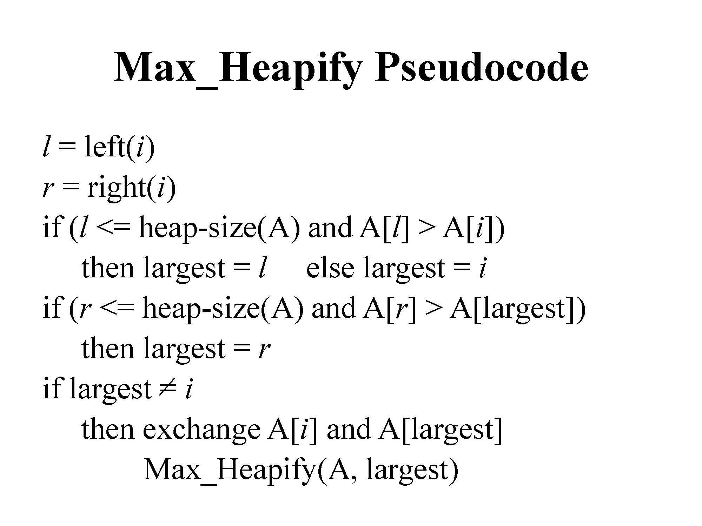
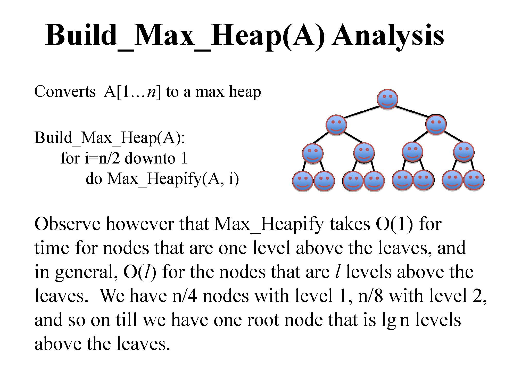
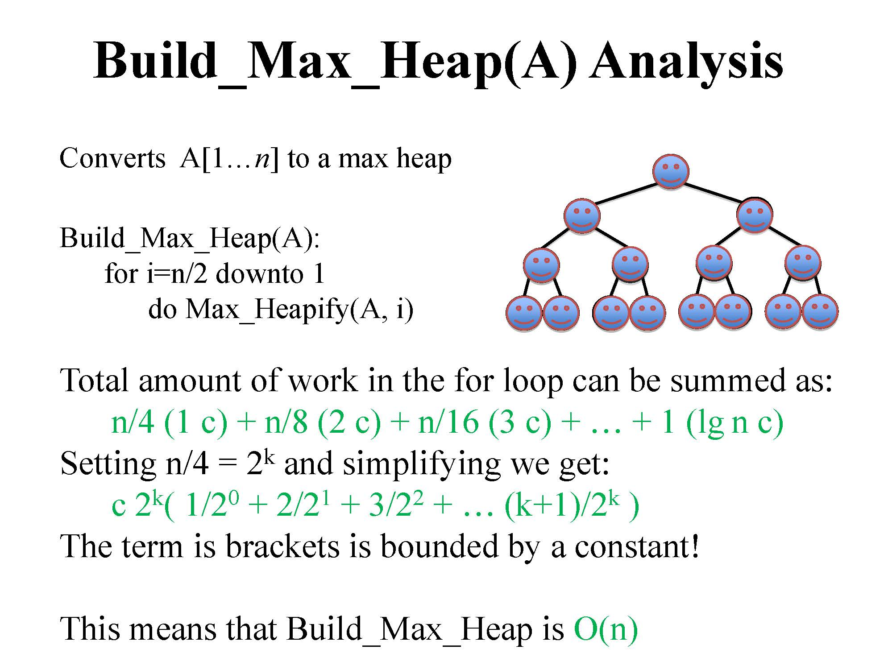
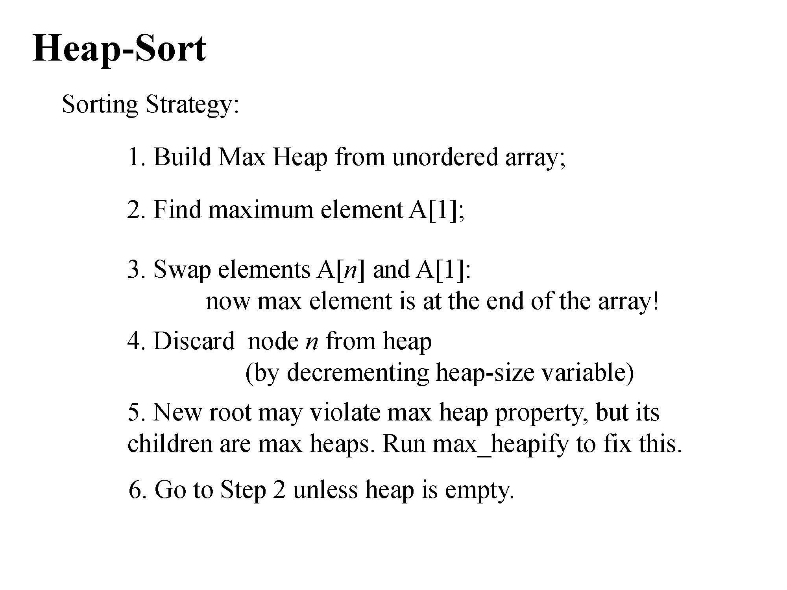
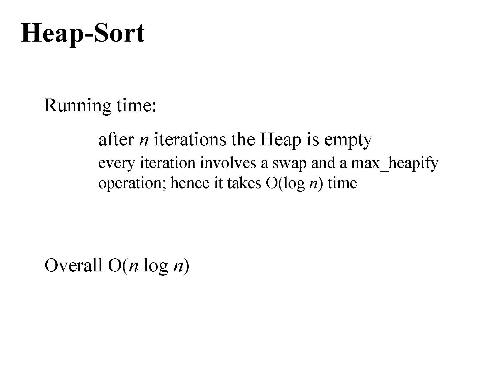

# 堆

堆是一颗<u>**完全二叉树**</u>，树中每个结点的值都不小于(或不大于)其左右孩子结点的值。

使用数组来存储完全二叉树，第一个结点将存储于数组中的1号位，数组i号位表示的结点的左孩子是2i号位，右孩子是2i+1号位。

------

# 向下调整

总是将当前结点V与它的左右孩子比较(如果有的话)，假如孩子中存在权值比结点V的权值大的，就将其中权值最大的那个孩子结点与结点V交换。交换完毕后继续让结点V和孩子比较，直到结点V的孩子的权值都比结点V的权值小或结点V不存在孩子结点。<u>**时间复杂度O(logn)。**</u>




```c++
void downAdjust(int low, int high) {
    int i = low, j = low * 2;
    while (j <= high) {
        if (j + 1 <= high && heap[j] < heap[j + 1]) j = j + 1;
        if (heap[i] < heap[j]) {
            swap(heap[i], heap[j]);
            i = j; j = i * 2;
        } else break;
    }
}
```

------

# 建堆






------

# 向上调整

把想要调整的结点和父亲结点比较，如果权值比父亲结点大，那么就交换其与父亲结点，反复比较，直到堆顶或者父亲结点的权值比较大位置。<u>**时间复杂度为O(logn)。**</u>

```c++
void upAdjust(int low, int high) {
    int i = high, j = high / 2;
    while (j >= low) {
        if (heap[i] > heap[j]) {
            swap(heap[i], heap[j]);
            i = j; j = i / 2;
        } else break;
    }
}
```

<u>**删除堆顶元素**</u>：最后一个元素覆盖堆顶元素，元素个数减1，然后对根结点进行调整。<u>**时间复杂度为O(logn)。**</u>

```c++
void deleteTop() {
    heap[1] = heap[N--];
    downAdjust(1, N);
}
```

<u>**添加元素**</u>：把想要添加的元素放在数组最后，然后进行向上调整。<u>**时间复杂度为O(logn)。**</u>

```c++
void insertElem(int data) {
    heap[++N] = data;
    upAdjust(1, N);
}
```

------

# 堆排序





```c++
void heapSort() {
    for (int n = N; n >= 2; n--) {
        swap(heap[1], heap[n]);
        downAdjust(1, n - 1);
    }
}
```

